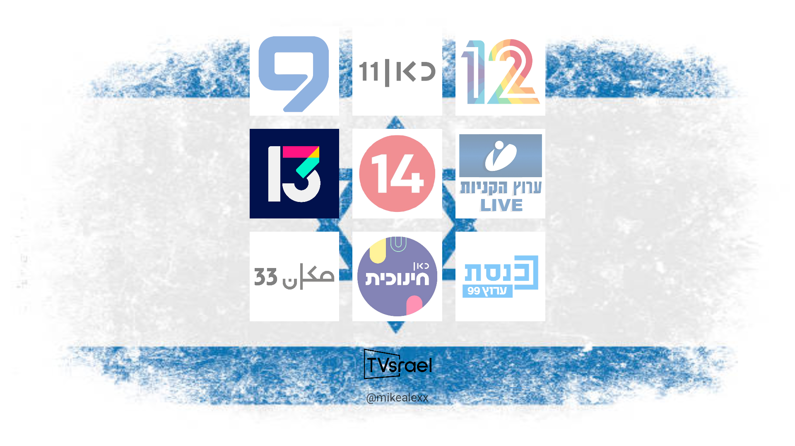

# TVsrael

Welcome to TVsrael, your go-to app for accessing all major free Israeli TV channels in one convenient place.

## Features

- **Comprehensive Channel List**: Access to all major free Israeli TV channels, including news, entertainment, sports, and more.
- **Live Streaming**: High-quality live streaming for all channels with adaptive streaming to ensure smooth playback.
- **User-Friendly Interface**: Intuitive and clean UI designed for easy browsing and channel selection.
- **Customizable Favorites**: Create a list of favorite channels for quick access.
- **Multi-Device Support**: Optimized for both smartphones and tablets, providing a consistent experience across different screen sizes.

## Installation

To install the TVsrael app, follow these steps:

1. **Download the APK**:
   - Visit the [Releases](https://github.com/yourusername/TVsrael/releases) page to download the latest version of the TVsrael APK.

2. **Install the APK**:
   - Transfer the downloaded APK to your Android device.
   - Open the APK file on your device and follow the on-screen instructions to install the app.
   - You may need to enable installation from unknown sources in your device settings.

## Usage

1. **Open the App**:
   - Launch the TVsrael app from your device’s app drawer.

2. **Browse Channels**:
   - Navigate through the organized channel list to find your desired TV channel.

3. **Live Stream**:
   - Tap on any channel to start live streaming.

4. **Add to Favorites**:
   - Long-press on a channel to add it to your favorites for quick access.

## Screenshots

## Privacy Policy

We do not collect any personal information from users. For more details, please refer to our [Privacy Policy](Privacy_Policy.md).

## Contact Us

If you have any questions, feedback, or issues, please contact us at [Email Us](mailto:youremail@example.com).

## License

This project is licensed under the MIT License. See the [LICENSE](LICENSE) file for details.

---

#### The TVsrael App Development Team
